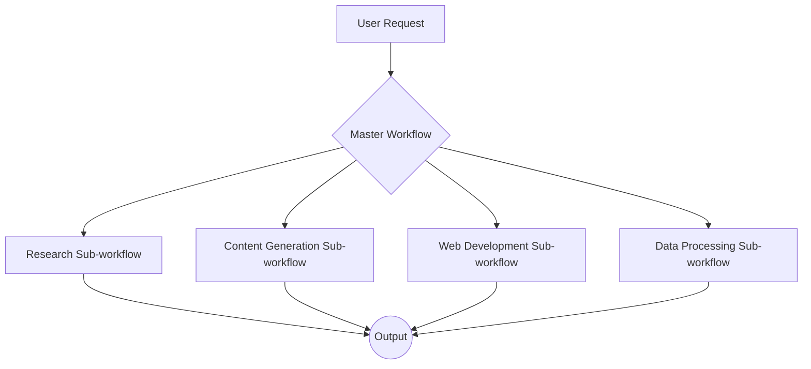

# Recommended N8N Workflow Architecture

This document outlines a recommended workflow architecture for building complex AI agent capabilities in N8N. The proposed architecture is modular, scalable, and designed for maintainability.

## 1. Core Principles

- **Modularity:** The architecture is based on a master/sub-workflow pattern. This promotes reusability and makes the system easier to understand and manage.
- **Scalability:** The use of sub-workflows and a queue-based execution model allows for horizontal scaling.
- **Separation of Concerns:** Each sub-workflow is responsible for a specific domain (e.g., research, content generation), which promotes a clean separation of concerns.

## 2. Architecture Overview

The architecture consists of a **Master Workflow** that acts as the central orchestrator and a set of specialized **Sub-workflows** that perform specific tasks.

### 2.1. Master Workflow

The Master Workflow is the entry point for all requests. Its primary responsibilities are:

- **Request Parsing:** To parse the incoming user request and determine which sub-workflow(s) to execute.
- **Sub-workflow Orchestration:** To call the appropriate sub-workflows and pass the necessary data to them.
- **Result Aggregation:** To aggregate the results from the sub-workflows and format the final output.
- **State Management:** To manage the overall state of the task.

### 2.2. Sub-workflows

Sub-workflows are specialized workflows that are responsible for a specific domain. Examples include:

- **Research Sub-workflow:** This sub-workflow would be responsible for gathering information from various sources, such as web pages, APIs, and documents.
- **Content Generation Sub-workflow:** This sub-workflow would be responsible for generating text, images, and other content using AI models.
- **Web Development Sub-workflow:** This sub-workflow would be responsible for automating web development tasks, such as generating code, running tests, and deploying applications.
- **Data Processing Sub-workflow:** This sub-workflow would be responsible for processing and analyzing data from various sources.

## 3. Data Flow and State Management

- **Data Flow:** Data is passed between the master workflow and the sub-workflows as JSON objects. The `Execute Workflow` node is used to call sub-workflows and pass data to them.
- **State Management:** For complex, long-running tasks, the state of the task should be stored in an external database (e.g., Postgres, MySQL). The master workflow would be responsible for reading and writing the state to the database.

## 4. Error Handling

Each sub-workflow should have its own error handling logic. The master workflow should be designed to handle errors from the sub-workflows and to retry failed operations if necessary.

## 5. Parallel Processing

For tasks that can be parallelized, the master workflow can call multiple sub-workflows in parallel. This can significantly improve the performance of the system.
