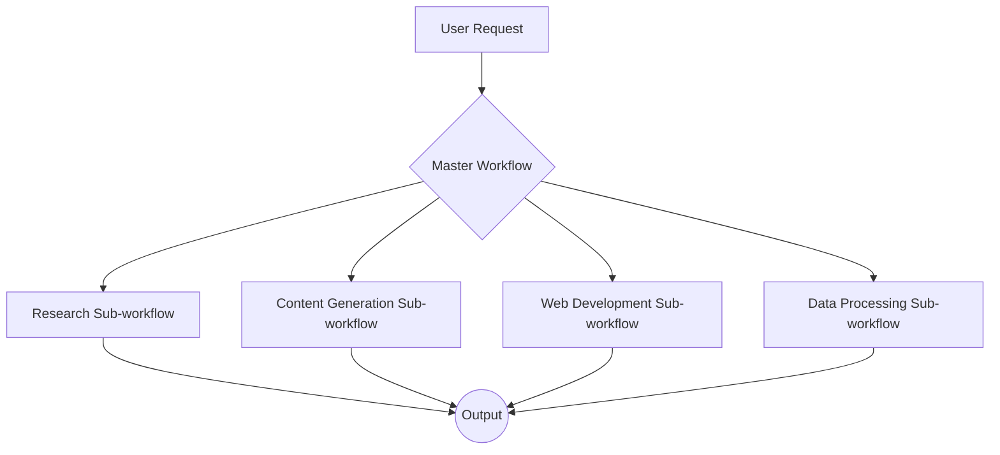

# N8N for AI Platform Replication: Final Report

This report summarizes the findings of a comprehensive research project to assess the feasibility of replicating the capabilities of several leading AI platforms using the N8N workflow automation system.

## 1. Introduction

The goal of this research was to understand the technical capabilities of the N8N platform and to determine its suitability for building complex AI agent functionalities, including research, content generation, web development, data processing, and multi-service integration.

## 2. N8N Capabilities Analysis

---
*Content from `docs/n8n_capabilities_analysis.md` will be inserted here.*
---

## 3. AI Platform Feature Mapping to N8N

---
*Content from `docs/feature_mapping.md` will be inserted here.*
---

## 4. Technical Feasibility Assessment

---
*Content from `docs/feasibility_assessment.md` will be inserted here.*
---

## 5. Recommended Workflow Architecture

---
*Content from `docs/workflow_architecture.md` will be inserted here.*
---

## 6. Implementation Roadmap

---
*Content from `docs/implementation_roadmap.md` will be inserted here.*
---

## 7. Limitations and Workaround Strategies

---
*Content from `docs/limitations_and_workarounds.md` will be inserted here.*
---

## 8. Required External Services and API Integrations

---
*Content from `docs/external_services.md` will be inserted here.*
---

## 9. Conclusion

N8N is a powerful and flexible workflow automation platform that can be used to replicate many of the capabilities of the analyzed AI platforms. Its strength lies in its ability to integrate with a wide range of external services and APIs, making it an excellent choice for orchestrating complex AI workflows.

While N8N is not a silver bullet, and there are some limitations to be aware of, these can be overcome with careful planning and by using the workaround strategies outlined in this report.

By following the recommended workflow architecture and implementation roadmap, it is possible to build a robust and scalable AI agent platform using N8N.

---

# N8N Capabilities Analysis

This document provides a comprehensive analysis of the N8N platform's capabilities, with a focus on its potential for replicating the functionalities of advanced AI platforms.

## 1. N8N Platform Architecture

N8N's architecture is designed for flexibility and scalability. It can be deployed in various configurations, from a single instance for development to a distributed, queue-based system for large-scale production workloads.

### 1.1. Execution Modes

N8N offers two primary execution modes:

- **Manual Mode:** Used for developing and testing workflows. Workflows can be executed manually to inspect the data flow and debug issues.
- **Production Mode:** For active workflows that are triggered automatically by external events (e.g., webhooks, schedules).

### 1.2. Scaling

N8N can be scaled to handle a large number of workflows and executions. The recommended approach for scaling is to use **queue mode**, which decouples the main process from the execution of workflows. This allows for horizontal scaling by adding more worker instances to process the workflow queue.

Key considerations for scaling include:

- **Database Performance:** N8N supports various databases, with PostgreSQL being a popular choice for production. Proper database configuration and maintenance are crucial for performance.
- **Data Pruning:** Regularly pruning execution data is essential to keep the database size manageable and maintain performance.
- **Concurrency Control:** N8N provides options for controlling the concurrency of workflows to prevent overloading the system.

### 1.3. Data Flow

N8N's data flow is item-based. Each node in a workflow processes a list of items, and it can perform actions on each item individually. This allows for powerful data manipulation and transformation within a workflow. Data is passed between nodes in a structured JSON format, making it easy to work with.

## 2. Workflow Capabilities

### 2.1. Workflow Execution

- **Executions:** An execution represents a single run of a workflow. N8N keeps a log of all executions, which can be reviewed for auditing and debugging purposes.
- **Sub-workflows:** N8N supports the use of sub-workflows, which allows for modular and reusable workflow design. A workflow can call another workflow and pass data to it.

### 2.2. Conditional Logic

N8N provides several nodes for implementing conditional logic, such as the **IF** and **Switch** nodes. These nodes allow for branching workflows based on the data they receive.

### 2.3. Error Handling

N8N has built-in error handling capabilities. You can configure workflows to handle errors gracefully, for example, by sending a notification or retrying a failed operation. The **On Error** setting in each node provides granular control over error handling.

## 3. Nodes and Integrations

N8N has a vast library of over 1000 nodes and integrations. These nodes are the building blocks of workflows and provide a wide range of functionalities.

### 3.1. Node Categories

- **AI:** Nodes for interacting with AI services, including LLMs, vector stores, and more.
- **Communication:** Nodes for sending and receiving messages via email, Slack, Discord, and other platforms.
- **Data & Storage:** Nodes for connecting to databases, spreadsheets, and other data sources.
- **Developer Tools:** Nodes for making HTTP requests, executing code, and interacting with APIs.
- **And many more...**

### 3.2. Custom Nodes

If a specific integration or functionality is not available out-of-the-box, you can create your own custom nodes using TypeScript. This makes N8N highly extensible and adaptable to any use case.

## 4. Performance and Scalability

As mentioned earlier, N8N is designed to be scalable. By using queue mode and optimizing the database and data pruning settings, you can build a robust and high-performance automation platform.

For more detailed information, please refer to the official N8N documentation:

- **[N8N Documentation](https://docs.n8n.io/)**
- **[N8N Integrations](https://n8n.io/integrations/)**

---

# AI Platform Feature Mapping to N8N

This document maps the features of the analyzed AI platforms to the corresponding N8N capabilities, nodes, and workflow patterns.

## 1. Manus.im

| Manus.im Feature                | N8N Capability/Node                                                                                                                                                           |
| ------------------------------- | ----------------------------------------------------------------------------------------------------------------------------------------------------------------------------- |
| Autonomous task execution       | N8N workflows with triggers (e.g., Schedule, Webhook) and a sequence of actions.                                                                                              |
| Multi-modal processing          | N8N can handle text, and with custom nodes or HTTP requests to external APIs, it can process images and other data formats.                                                   |
| Advanced tool integration       | N8N's core strength. It can integrate with a vast number of tools and services through its nodes and HTTP Request node.                                                        |
| Adaptive learning               | This is a more advanced concept that would require a combination of N8N workflows, a database to store learning data, and an external AI service for the learning logic.        |
| Information retrieval           | N8N can retrieve information from various sources using nodes like HTTP Request, Read PDF, and by integrating with search APIs.                                                  |
| Data processing                 | N8N provides a rich set of nodes for data processing, including Set, Function, and various data manipulation nodes.                                                          |
| Code execution                  | The **Execute Command** and **Function** nodes allow for the execution of custom code (JavaScript, Python, etc.).                                                               |
| Content Types (Image, etc.)     | N8N can handle various content types. For generation, it would rely on external services like OpenAI (DALL-E) for images, and other specialized APIs for slides, etc.      |

## 2. Lovable.dev

| Lovable.dev Feature             | N8N Capability/Node                                                                                                                                                           |
| ------------------------------- | ----------------------------------------------------------------------------------------------------------------------------------------------------------------------------- |
| AI-powered app/website creation | This is a complex feature that would require a sophisticated N8N workflow. It would involve a series of steps, from gathering requirements to generating code and deploying it.     |
| Figma Import                    | N8N could use the Figma API (via the HTTP Request node) to import design information.                                                                                       |
| Community Remix                 | N8N workflows can be shared and reused. The concept of "remixing" can be achieved by providing template workflows that users can customize.                                        |
| Image Input                     | N8N can receive images via webhooks or other triggers. These images can then be passed to an AI service for processing.                                                        |
| Diverse Project Types           | N8N's flexibility allows for the creation of workflows that can handle various project types. The logic for each project type would be defined within the workflow.           |

## 3. ChatLLM (Abacus.ai)

| ChatLLM Feature                 | N8N Capability/Node                                                                                                                                                           |
| ------------------------------- | ----------------------------------------------------------------------------------------------------------------------------------------------------------------------------- |
| Multi-Modal Generation          | N8N can integrate with various AI services for image and video generation via their APIs (e.g., OpenAI, Stability AI).                                                         |
| AI Agents                       | N8N can be used to build AI agents by chaining together multiple nodes that perform specific tasks.                                                                          |
| Web Interaction                 | The **HTTP Request** node can be used for web scraping and interacting with web services.                                                                                     |
| Code & Data                     | The **Execute Command** and **Function** nodes can be used for code execution and data analysis.                                                                                 |
| Integrations (GitHub, etc.)     | N8N has dedicated nodes for GitHub, Slack, and Teams, making it easy to integrate with these platforms.                                                                      |
| Task Automation                 | This is N8N's core competency.                                                                                                                                               |
| Text-to-Speech                  | N8N can integrate with text-to-speech APIs (e.g., Google Cloud Text-to-Speech, Amazon Polly) to convert text to audio.                                                         |

## 4. MiniMax Platform

| MiniMax Platform Feature        | N8N Capability/Node                                                                                                                                                           |
| ------------------------------- | ----------------------------------------------------------------------------------------------------------------------------------------------------------------------------- |
| Foundation Models               | N8N can interact with the MiniMax foundation models via their API using the HTTP Request node.                                                                               |
| AI Applications                 | N8N can be used to build similar AI applications by orchestrating various AI services and tools.                                                                             |
| Developer Platform              | N8N itself is a developer platform for building workflows. It can also interact with other developer platforms via their APIs.                                                  |

---

# Technical Feasibility Assessment

This document provides a detailed technical feasibility assessment for replicating the major capabilities of the analyzed AI platforms using N8N.

## 1. Autonomous Task Execution

- **Feasibility:** High
- **N8N Implementation:**
    - **Triggers:** N8N's trigger nodes (e.g., `Schedule`, `Webhook`, `Cron`) are the foundation of autonomous execution. They can initiate workflows based on time or external events.
    - **Workflow Logic:** A sequence of nodes can be used to define the steps of a task. The `Switch` and `IF` nodes provide conditional logic for decision-making.
    - **State Management:** For complex, long-running tasks, a database (e.g., Postgres, MySQL) can be used to store the state of the task, allowing the workflow to be paused and resumed.
- **Challenges:**
    - **Complex State Management:** For highly complex and stateful tasks, managing the state in an external database can add complexity to the workflow.
    - **Error Handling:** While N8N has error handling, designing robust error handling for complex autonomous tasks requires careful planning.

## 2. Multi-modal Processing

- **Feasibility:** Medium to High (depending on the modality)
- **N8N Implementation:**
    - **Text:** N8N has strong native support for text processing.
    - **Images:** Images can be received via webhooks and passed to external services like Google Cloud Vision or AWS Rekognition for analysis. For generation, DALL-E or Stable Diffusion APIs can be used.
    - **Video:** Similar to images, video processing would rely on external services (e.g., Google Cloud Video AI, AWS Transcribe for audio extraction). Video generation is also possible via APIs.
    - **Data:** N8N excels at data processing, with nodes for reading, writing, and transforming various data formats.
- **Challenges:**
    - **Binary Data Handling:** While N8N can handle binary data, it can be memory-intensive. For large files, it's recommended to use external storage (e.g., S3) and pass around references to the data.
    - **API Costs:** Relying on external APIs for multi-modal processing can incur significant costs.

## 3. Advanced Tool Integration

- **Feasibility:** High
- **N8N Implementation:**
    - **HTTP Request Node:** The `HTTP Request` node is the workhorse for tool integration. It can be used to interact with any REST or GraphQL API.
    - **Pre-built Integrations:** N8N has a large and growing library of pre-built integrations for popular services.
    - **Custom Nodes:** For complex integrations, custom nodes can be developed in TypeScript.
- **Challenges:**
    - **Authentication:** Managing authentication for a large number of integrations can be challenging. N8N provides a credentials store to help with this.
    - **API Rate Limits:** Workflows need to be designed to handle API rate limits.

## 4. AI-Powered App/Website Creation

- **Feasibility:** Low to Medium
- **N8N Implementation:**
    - This is a highly complex capability that would stretch the limits of what is practical with N8N alone. It would require a sophisticated workflow that orchestrates a series of external services:
        - **Requirement Gathering:** A conversational AI service (e.g., Rasa, Dialogflow) would be needed to interact with the user.
        - **Design Import:** The Figma API could be used to import design specifications.
        - **Code Generation:** An AI code generation service (e.g., OpenAI's Codex) would be needed to generate the application code.
        - **Deployment:** A CI/CD tool (e.g., Jenkins, GitLab CI) would be needed to deploy the application.
- **Challenges:**
    - **Complexity:** The workflow would be extremely complex and difficult to manage.
    - **Reliability:** The reliability of the end-to-end process would be dependent on the reliability of multiple external services.
    - **Cost:** The cost of using all the required external services would be substantial.

## 5. Code Execution and Automation

- **Feasibility:** High
- **N8N Implementation:**
    - **Execute Command Node:** The `Execute Command` node can be used to run shell commands, which allows for the execution of scripts in any language.
    - **Function Node:** The `Function` node allows for the execution of JavaScript code directly within the workflow.
    - **GitHub/GitLab Integration:** N8N has nodes for interacting with GitHub and GitLab, which can be used to automate tasks like creating pull requests and managing repositories.
- **Challenges:**
    - **Security:** Executing arbitrary code can be a security risk. It's important to run N8N in a secure environment and to carefully vet any code that is executed.
    - **Dependency Management:** Managing dependencies for custom scripts can be challenging. It may be necessary to use a containerized environment (e.g., Docker) to ensure that the correct dependencies are available.

## 6. Multi-Service Integration

- **Feasibility:** High
- **N8N Implementation:**
    - N8N's core competency is integrating multiple services. A workflow can be designed to orchestrate a series of calls to different services, passing data between them.
- **Challenges:**
    - **Data Mapping:** Mapping data between different services can be complex, but N8N's data transformation nodes can help with this.
    - **Error Handling:** Handling errors from multiple services requires careful planning.

---

# Recommended N8N Workflow Architecture

This document outlines a recommended workflow architecture for building complex AI agent capabilities in N8N. The proposed architecture is modular, scalable, and designed for maintainability.

## 1. Core Principles

- **Modularity:** The architecture is based on a master/sub-workflow pattern. This promotes reusability and makes the system easier to understand and manage.
- **Scalability:** The use of sub-workflows and a queue-based execution model allows for horizontal scaling.
- **Separation of Concerns:** Each sub-workflow is responsible for a specific domain (e.g., research, content generation), which promotes a clean separation of concerns.

## 2. Architecture Overview

The architecture consists of a **Master Workflow** that acts as the central orchestrator and a set of specialized **Sub-workflows** that perform specific tasks.

### 2.1. Master Workflow

The Master Workflow is the entry point for all requests. Its primary responsibilities are:

- **Request Parsing:** To parse the incoming user request and determine which sub-workflow(s) to execute.
- **Sub-workflow Orchestration:** To call the appropriate sub-workflows and pass the necessary data to them.
- **Result Aggregation:** To aggregate the results from the sub-workflows and format the final output.
- **State Management:** To manage the overall state of the task.

### 2.2. Sub-workflows

Sub-workflows are specialized workflows that are responsible for a specific domain. Examples include:

- **Research Sub-workflow:** This sub-workflow would be responsible for gathering information from various sources, such as web pages, APIs, and documents.
- **Content Generation Sub-workflow:** This sub-workflow would be responsible for generating text, images, and other content using AI models.
- **Web Development Sub-workflow:** This sub-workflow would be responsible for automating web development tasks, such as generating code, running tests, and deploying applications.
- **Data Processing Sub-workflow:** This sub-workflow would be responsible for processing and analyzing data from various sources.

## 3. Data Flow and State Management

- **Data Flow:** Data is passed between the master workflow and the sub-workflows as JSON objects. The `Execute Workflow` node is used to call sub-workflows and pass data to them.
- **State Management:** For complex, long-running tasks, the state of the task should be stored in an external database (e.g., Postgres, MySQL). The master workflow would be responsible for reading and writing the state to the database.

## 4. Error Handling

Each sub-workflow should have its own error handling logic. The master workflow should be designed to handle errors from the sub-workflows and to retry failed operations if necessary.

## 5. Parallel Processing

For tasks that can be parallelized, the master workflow can call multiple sub-workflows in parallel. This can significantly improve the performance of the system.

---

# Implementation Roadmap

This document outlines a prioritized roadmap for implementing the AI agent capabilities in N8N.

## Phase 1: Core Infrastructure Setup (Priority: High)

- **1.1. N8N Environment Setup:**
    - [ ] Deploy N8N in a scalable, queue-based configuration.
    - [ ] Configure a production-grade database (e.g., PostgreSQL).
    - [ ] Set up a reverse proxy (e.g., Nginx) for secure access.
- **1.2. Logging and Monitoring:**
    - [ ] Implement a centralized logging solution (e.g., ELK stack) to collect and analyze logs from N8N.
    - [ ] Set up a monitoring system (e.g., Prometheus, Grafana) to monitor the health and performance of the N8N instance.
- **1.3. Version Control:**
    - [ ] Establish a Git repository for managing N8N workflows and custom nodes.

## Phase 2: Foundational Sub-workflows (Priority: High)

- **2.1. Research Sub-workflow:**
    - [ ] Implement a sub-workflow for performing web searches using various search engine APIs.
    - [ ] Add the capability to extract content from web pages.
    - [ ] Integrate with document reading services (e.g., for PDF and DOCX files).
- **2.2. Content Generation Sub-workflow:**
    - [ ] Integrate with a leading LLM provider (e.g., OpenAI) for text generation.
    - [ ] Add the capability to generate images using a service like DALL-E or Stability AI.

## Phase 3: Advanced Capabilities (Priority: Medium)

- **3.1. Web Development Sub-workflow:**
    - [ ] Integrate with the Figma API to import design specifications.
    - [ ] Implement a workflow for generating code using an AI code generation service.
    - [ ] Integrate with a CI/CD tool for automated deployment.
- **3.2. Multi-modal Processing Sub-workflow:**
    - [ ] Integrate with a video generation service.
    - [ ] Integrate with a speech-to-text service.
    - [ ] Integrate with a text-to-speech service.

## Phase 4: Integration and Testing (Priority: High)

- **4.1. Master Workflow Implementation:**
    - [ ] Implement the master workflow to orchestrate the sub-workflows.
    - [ ] Implement the request parsing and result aggregation logic.
- **4.2. End-to-End Testing:**
    - [ ] Perform thorough end-to-end testing of the entire system.
    - [ ] Create a suite of automated tests to ensure the ongoing reliability of the system.

---

# N8N Limitations and Workaround Strategies

This document outlines the known limitations of the N8N platform and provides strategies for working around them.

## 1. Platform Limitations

- **Limited Built-in AI Capabilities:** N8N is an automation platform, not an AI platform. While it has excellent support for integrating with AI services, it does not have any built-in AI capabilities of its own.
    - **Workaround:** Leverage external AI services via their APIs. This is the intended use case for N8N.
- **No Native Support for Complex UI:** N8N is not designed for building complex user interfaces. It is a backend automation tool.
    - **Workaround:** For tasks that require a user interface, use a separate front-end framework (e.g., React, Vue.js) and have it communicate with N8N via webhooks.
- **State Management for Long-Running Workflows:** While N8N can handle long-running workflows, managing the state of these workflows can be challenging.
    - **Workaround:** Use an external database (e.g., Postgres, MySQL) to store the state of the workflow. The workflow can then be designed to be stateless, with the state being passed in as a parameter.

## 2. Scalability and Performance

- **Single Point of Failure:** In a non-distributed setup, the main N8N process can be a single point of failure.
    - **Workaround:** Deploy N8N in a high-availability configuration with multiple main instances and a load balancer.
- **Database Performance:** The database can become a bottleneck if it is not properly configured and maintained.
    - **Workaround:** Use a production-grade database, and regularly prune execution data to keep the database size manageable.
- **Memory Usage:** N8N can be memory-intensive, especially when handling large binary files.
    - **Workaround:** Use external storage (e.g., S3) for large files and pass around references to the data instead of the data itself.

## 3. Development and Maintenance

- **Workflow Complexity:** As workflows become more complex, they can be difficult to manage and debug.
    - **Workaround:** Use a modular architecture with sub-workflows to break down complex workflows into smaller, more manageable pieces. Also, make use of the notes and documentation features in N8N to document your workflows.
- **Testing:** Testing complex workflows can be challenging.
    - **Workaround:** Create a suite of automated tests that can be run against your workflows. This will help to ensure the ongoing reliability of your system.
- **Version Control:** N8N does not have built-in version control for workflows.
    - **Workaround:** Store your workflows in a Git repository. This will allow you to track changes, revert to previous versions, and collaborate with other developers.

---

# Required External Services and API Integrations

This document lists the external services and API integrations that are required to implement the AI agent capabilities in N8N.

## 1. AI/ML

- **Large Language Models (LLMs):**
    - [ ] OpenAI (GPT-3.5, GPT-4)
    - [ ] Anthropic (Claude)
    - [ ] Google (Gemini)
- **Image Generation:**
    - [ ] OpenAI (DALL-E 3)
    - [ ] Stability AI (Stable Diffusion)
    - [ ] Midjourney
- **Video Generation:**
    - [ ] RunwayML
    - [ ] Pika Labs
- **Speech-to-Text:**
    - [ ] Google Cloud Speech-to-Text
    - [ ] AWS Transcribe
- **Text-to-Speech:**
    - [ ] Google Cloud Text-to-Speech
    - [ ] AWS Polly
- **Vector Stores:**
    - [ ] Pinecone
    - [ ] Weaviate

## 2. Communication

- **Email:**
    - [ ] SendGrid
    - [ ] Mailgun
- **Chat:**
    - [ ] Slack
    - [ ] Microsoft Teams
    - [ ] Discord

## 3. Data & Storage

- **Databases:**
    - [ ] PostgreSQL
    - [ ] MySQL
- **Cloud Storage:**
    - [ ] AWS S3
    - [ ] Google Cloud Storage

## 4. Development and Deployment

- **Version Control:**
    - [ ] GitHub
    - [ ] GitLab
- **CI/CD:**
    - [ ] Jenkins
    - [ ] GitLab CI
- **Design:**
    - [ ] Figma

## 5. Other

- **Search:**
    - [ ] Google Search API
    - [ ] Bing Search API
- **Web Scraping:**
    - [ ] ScrapingBee
    - [ ] ScraperAPI
